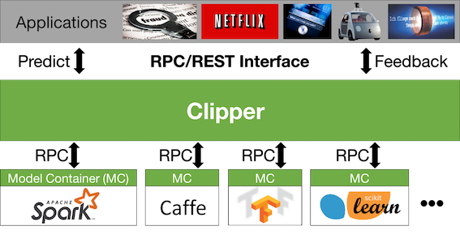

# Clipper

[](https://amplab.cs.berkeley.edu/jenkins/job/Clipper/)

## Project Overview



## What is Clipper?

Clipper is a prediction serving system that sits between user-facing applications and a wide range of commonly used machine learning models and frameworks.

## What does Clipper do?

* Clipper **simplifies integration of machine learning techniques** into user facing applications by providing a simple standard REST interface for prediction and feedback across a wide range of commonly used machine learning frameworks.  *Clipper makes product teams happy.*


* Clipper **simplifies model deployment** and **helps reduce common bugs** by using the same tools and libraries used in model development to render live predictions.  *Clipper makes data scientists happy.*


* Clipper **improves throughput** and ensures **reliable millisecond latencies** by introducing adaptive batching, caching, and straggler mitigation techniques.  *Clipper makes the infra-team less unhappy.*

* Clipper **improves prediction accuracy** by introducing state-of-the-art bandit and ensemble methods to intelligently select and combine predictions and achieve real-time personalization across machine learning frameworks.  *Clipper makes users happy.*


## Why are we building Clipper?

We are group of researchers in the UC Berkeley [RISE Lab](https://rise.cs.berkeley.edu/) studying the fundamental challenges around taking machine learning to production.  In collaboration with leading industrial and research organizations ([sponsors](https://rise.cs.berkeley.edu/sponsors/)), we identified model deployment as one of the next big challenges in the wide-scale adoption of AI technologies.

Deploying trained machine-learning models into production today is an ad-hoc, labor-intensive, and error-prone process. This creates an enormous impediment to building and maintaining user-facing applications that incorporate machine-learning.

Clipper is designed to simplify this process by decoupling applications that
consume predictions from trained models that produce predictions.
Clipper is a robust, high-performance serving system that can scale to thousands of requests per second and provide 
responses that meet latency service level objectives on the order of milliseconds.
As a result, Clipper can be safely incorporated into a production serving stack without negatively
impacting application latencies.

At the same time, Clipper allows data scientists to easily deploy trained models to production.
Data science is an iterative process, and simplifying the model deployment process allows
data scientists to more easily experiment with new features and models to quickly improve
application accuracy. Data scientists deploy models to Clipper with the same code used for
training, eliminating a common class of bugs in machine-learning that arise from code duplication.
And Clipper supports deploying models trained in many machine learning frameworks and implemented
in a variety of programming languages to support the rich ecosystem of data science tools available today.


## Key Features

+ Deploy models trained in your choice of framework to Clipper with a few lines of code by using an existing model container or writing your own
+ Easily update or add models to running applications
+ Use adversarial bandit algorithms to dynamically select best model for prediction at serving time
+ Set latency service level objectives for reliable query latencies
+ Run each model in a separate Docker container for simple cluster management and resource allocation
+ Deploy models running on CPUs, GPUs, or both in the same application

## Getting Started

The easiest way to get started running Clipper is with Docker.

Download the Clipper [`docker-compose.yml`](docker/docker-compose.yml) configuration and start Clipper:

```sh
curl -O https://raw.githubusercontent.com/ucbrise/clipper/develop/docker/docker-compose.yml \
       && docker-compose up -d query_frontend
```

Alternatively, if you've already cloned the repository, you can run:

```sh
cd docker && docker-compose up -d query_frontend
```

For an example of querying Clipper, see the Python [example client](examples/basic_query/example_client.py).

The best way to explore Clipper's features is through the [tutorial](examples/tutorial/tutorial.md).

For more information on running Clipper with Docker, check out the [Docker README](docker/README.md).

## Next Steps

### Developing Clipper

Development of Clipper is coordinated through GitHub.

To get started, clone the repository including submodules:

```sh
git clone --recursive https://github.com/ucbrise/clipper.git
```

> If you've already cloned the repository at this point without the submodules,
> you can include them by running `git submodule update --init --recursive` in
> the Clipper repo.

__Build Dependencies:__

+ Boost >= 1.60
+ cmake >= 3.2
+ zeromq >= 4.1.6
+ hiredis
+ libev
+ redis-server >= 3.2


__Building Clipper:__

First generate the CMake files with `./configure`. This generates an out-of-source build directory called `debug`.
Go into this directory and then run `make` to actually
compile the code. You should only need to re-run the configuration script if you change one of the `CMakeLists.txt` files.
To build for release, run `./configure --release` which generates the `release` build directory instead of debug.
If you want to clean everything up, you can run `./configure --cleanup` (if you get tired of being prompted, you can run `./configure --cleanup-quiet` to force cleanup without prompting).

__NOTE:__ Redis must be installed and on your path to run both the query REST frontend and the unit-tests.
You can test this with `redis-server --version`.

For example:

```sh
cd $CLIPPER_ROOT_DIR
./configure
cd debug
make

# write some code and compile it
make

# build and run unit tests with googletest
../bin/run_unittests.sh

# build and then start the query REST frontend
../bin/start_clipper.sh

```

__Using Vagrant:__

You can use Vagrant to automatically create a development environment in a virtual machine.
This is one method for using Windows for Clipper development. Before you start, you must have [Vagrant](https://www.vagrantup.com/) and [VirtualBox](https://www.virtualbox.org/wiki/VirtualBox)
installed.  Once you have them installed, perform the following command to initialize Vagrant.

```sh
vagrant up
```

And the environment will be created for you. You can now edit Clipper files
on your local machine and when you want to test your changes, you can just
perform the following commands:

```sh
# Log in to the virtual machine
vagrant ssh

# Enter root Clipper directory
cd /vagrant

# Run tests
./bin/run_unittests.sh
```

Clipper has been tested on OSX 10.11, 10.12, and on Debian stretch/sid and Ubuntu 12.04 and 16.04. It does not support Windows.

## Status and Roadmap

Clipper is currently under active development in preparation for an 0.1 alpha release
in mid-April.

### Features for 0.1 Release

The 0.1 release will be focused on providing a reliable, robust system for serving
predictions for single model applications.

+ First class support for application and model management via a management REST API and accompanying Python client-side management library
+ Robust system implementation to minimize application downtime
+ First class support for serving Scikit-Learn models, Spark ML and Spark MLLib models,
  and arbitrary Python functions with pre-implemented model containers
+ Extensible metrics library for measuring and reporting system performance metrics


### Beyond 0.1

The priorities of Clipper in the near-term are to improve support for the entire
machine-learning application lifecycle, including the ongoing maintenance and evolution
of deployed machine-learning applications and support for new types of models and specialized
hardware support. Critical features include:

+ Support for selection policies and multi-model applications including the use of adversarial bandit algorithms
+ Model performance monitoring to detect and prevent application performance degradation over time
+ New scheduler design to leverage the model and resource heterogeneity common to machine learning applications

## Additional Resources

+ [Design Doc (work-in-progress)](https://docs.google.com/document/d/1Ghc-CAKXzzRshSa6FlonFa5ttmtHRAqFwMg7vhuJakw/edit?usp=sharing)
+ [Research Paper](https://arxiv.org/abs/1612.03079)
+ [Talk at Spark Summit East 2017](https://spark-summit.org/east-2017/events/clipper-a-low-latency-online-prediction-serving-system/) [[Slides]](https://www.slideshare.net/SparkSummit/clipper-a-lowlatency-online-prediction-serving-system-spark-summit-east-talk-by-dan-crankshaw) [[Video]](https://youtu.be/4sdK2dp94Hw)


## Contributing

To file a bug or request a feature, please file a GitHub issue. Pull requests are welcome.

Before filing a pull request, make sure that C++ code conforms to the project's Clang-Format style file and Python code conforms to the PEP 8 style. To automatically format your code before submitting a pull request, you can use
the provided formatting script:

```sh
./bin/format_code.sh
```


Our mailing list is <clipper-dev@googlegroups.com>. For more information about the project, please contact Dan Crankshaw (<crankshaw@cs.berkeley.edu>).

Development planning and progress is tracked with the [Clipper Jira](https://clipper.atlassian.net/projects/CLIPPER/issues).

[](https://opensource.org/licenses/Apache-2.0)

## Acknowledgements

This research is supported in part by DHS Award HSHQDC-16-3-00083, DOE Award SN10040 DE-SC0012463, NSF CISE Expeditions Award CCF-1139158, and gifts from Ant Financial, Amazon Web Services, CapitalOne, Ericsson, GE, Google, Huawei, Intel, IBM, Microsoft and VMware.
