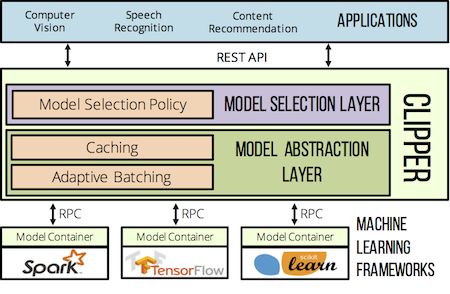

# Clipper

Clipper is a system for serving machine-learning predictions to interactive, user-facing
applications. Deploying trained machine-learning models into production today is an ad-hoc,
labor-intensive, and error-prone process. This creates an enormous impediment to
building and maintaining user-facing applications that incorporate machine-learning.
Clipper is designed to simplify this process by decoupling applications that
consume predictions from trained models that produce predictions.

Clipper is a robust,
high-performance serving system that can scale to thousands of requests per second and provide
responses that meet latency service level objectives on the order of milliseconds.
As a result, Clipper can be safely incorporated into a production serving stack without a
detrimental impact on an application's request latency.

Simultaneously, Clipper allows data scientists to easily deploy trained models to production.
Data science is an iterative process, and simplifying the model deployment process allows
data scientists to more easily experiment with new features and models to quickly improve
application accuracy. Data scientists deploy models to Clipper with the same code used for
training, eliminating a common class of bugs in machine-learning that arise from code duplication.
And Clipper supports deploying models written in many programming languages to support the full
ecosystem of data science tools in use today spanning languages such as Python, C++, Java, and more.

Clipper is a project of the UC Berkeley [RISE Lab](https://rise.cs.berkeley.edu/).



## Key Features

+ Deploy models trained in your choice of framework to Clipper with a few lines of code by using an existing model container or writing your own
+ Easily update or add models to running applications
+ Use multi-armed bandit algorithms to dynamically select best model for prediction at serving time
+ Set latency service level objectives for reliable query latencies
+ Runs in Docker containers for simple cluster management and resource allocation
+ Deploy models running on CPUs, GPUs, or both in the same application

## Getting Started

The easiest way to get started running Clipper is with Docker. Clone
or download the repository, then run:

```sh
cd docker && docker-compose up -d query_frontend
```

For an example of querying Clipper, see the Python [example client](examples/basic_query/example_client.py).

The best way to explore Clipper's features is through the [tutorial iPython notebook](examples/cifar_demo/tutorial.ipynb).

## Next Steps

### Developing Clipper

Clipper is distributed through GitHub.

Clone the repository and submodules:
```
$ git clone --recursive https://github.com/ucbrise/clipper.git
```

__Dependencies:__

+ Boost >= 1.60
+ cmake >= 3.2
+ zeromq >= 4.1.6
+ hiredis
+ libev
+ redis-server >= 3.2


__Building Clipper:__

First generate the cmake files with `./configure`. This generates an out-of-source build directory called `debug`.
Go into one of this directory and then run `make` to actually
compile the code. You should only need to re-configure if you change one of the `CMakeLists.txt` files.
To build for release, run `./configure --release` which generates the `release` build directory instead of debug.
If you want to clean everything up, you can run `./configure --cleanup`.

__NOTE:__ Redis must be installed and on your path to run both the Query REST frontend and the unit-tests.

For example:
```
$ cd $CLIPPER_ROOT_DIR
$ ./configure
$ cd debug
$ make

# write some code and compile it
$ make

# build and run unit tests with googletest
$ ../bin/run_unittests.sh

# build and then start the query REST frontend
$ ../bin/start_clipper.sh
```

Clipper has been tested on OSX 10.11, 10.12, and on Debian stretch/sid and Ubuntu 12.04 and 16.04. It does not support Windows.

### Status and Roadmap

Clipper is currently under active development in preparation for an alpha release
in mid-April.

#### Features for 0.1 Release

The 0.1 release will be focused on providing a reliable, robust system for serving
predictions for single model applications.

+ First class support for application and model management via a management REST API and accompanying Python client-side management library.
+ Robust system implementation to minimize application downtime.
+ First class support for serving Scikit-Learn models, Spark.ml and Spark.mllib models,
  and arbitrary Python functions with pre-implemented model containers.
+ Extensible metrics library for measuring and reporting system performance metrics.


#### Beyond 0.1

The priorities of Clipper in the near-term are to improve support for the entire
machine-learning application lifecycle, including the ongoing maintenance and development
of existing machine-learning applications.

+ Support for selection policies and multi-model applications
+ Model performance monitoring
+ New scheduler design

### Additional Resources

+ [Design Doc (work-in-progress)](https://docs.google.com/document/d/1Ghc-CAKXzzRshSa6FlonFa5ttmtHRAqFwMg7vhuJakw/edit?usp=sharing)
+ [Research Paper](https://arxiv.org/abs/1612.03079)


### Contributing

To file a bug or request a feature, please file a GitHub issue. Pull requests are welcome.

Our mailing list is <clipper-dev@googlegroups.com>. For more information about the project, please contact Dan Crankshaw (<crankshaw@cs.berkeley.edu>).

Development planning and progress is tracked with the [Clipper Jira](https://clipper.atlassian.net/projects/CLIPPER/issues).

[](https://opensource.org/licenses/Apache-2.0)
