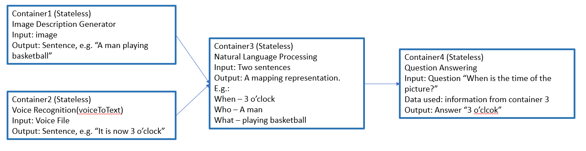

# Image Query App

 

## Overview
This application accepts an image and a audio file as initial input and generate description and key information of the input. Later, the user can input speech file to query for the information of the input. The model representation:

 

## Container Information
This application consists for four containers.

#### Container1: speech recognition. 
Input: audio file `(.wav)`; Output: `String`

#### Container2: image caption generator
Input: image file  `(.jpg)`; Output: `String` 

#### Container3: natural language processing
Input: String; Output: mapping `String`, in the format of `"[subject]-[predicate]-[time]"`

#### Container4: question answering
Input: mapping `String`; Output: `String`

 

## Additional Note on container implementation

### Container2 
- This app is hard to configure as it requires too much environment setting. So Try not to modify it. If you have to, whenever you change anything, say the name of the image you want to generate captions, search through the whole application to see if there'sany other names you should change at the same time.

- **If you are using Windows:**  
 Because of the CRLF problem, and pulling the code from github. Remeber to use Notepad++ or any other text editor to change the '\r\n' to '\n' in `runWithArg.sh` and `wrapper_script.sh`. Otherwise you may enter warning like "no such file or directory" when try running the script in docker. This trouble comes from the inconsistency in the design of Linux and Windows.

#### How this container works?
1. The first thing to notice is the `Dockerfile2` for this container. We are creating a workspace for Bazel under `/container/workspace` to reduce unnecessary bugs. The structure of directories are explained in the `Dockerfile2`.

2. `runWithArg.sh` is like the interface for `predict.py`. It accepts the file path of model checkpoint, `word_count.txt` and image path as argument from `predict.py` and in turn uses these arguments to call `run_inference.py` and that is where the real work for generating captions start.

3. The captions are generated in `run_inference.py` and are stored in `/container/workspace/captionData/captionFile.txt`. After finish executing run_inference.py, we read the content of captionFile.txt in predict.py and return the result in predict() to
the client.

 

### Container3
The libraries used in this container for NLP are `spacy` and `textacy`. Please refer to the official documentation if you are not familar with them.

