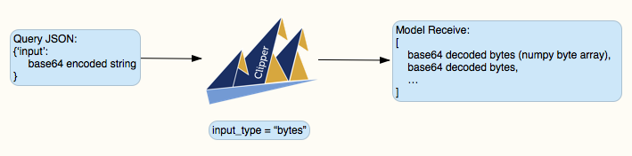
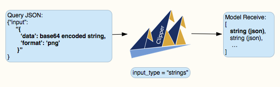

# Querying Clipper with an Image

This notebook shows how to setup Clipper to accept querying with image. We will deploy a function that compute the size of the image using [PIL](https://pillow.readthedocs.io/en/5.1.x/) image library and query it with image data. 


```python
import base64
import json
import requests
```

## Using input_type = "bytes"

An image can be read a string of raw bytes. Clipper can take any base64 encoded bytes as input and decode it to send to your model. 



Below, we define the query function and the model that calculate image size.

### Query Function
Our input JSON will contains a *base64 encoded string*. This can be done in the following three step procedure:

- Read in the raw bytes.


```python
raw_bytes = open('imgs/clipper-logo.png', "rb").read()
raw_bytes[:10]
```


    b'\x89PNG\r\n\x1a\n\x00\x00'


- Encode the raw bytes to base64 encoding, and note that the result is still bytes


```python
encoded_bytes = base64.b64encode(raw_bytes)
print(type(encoded_bytes))
encoded_bytes[:10]
```

    <class 'bytes'>


    b'iVBORw0KGg'


- Turn the bytes into string so json can serialize it


```python
encoded_string = encoded_bytes.decode()
print(type(encoded_string))
encoded_string[:10]
```

    <class 'str'>


    'iVBORw0KGg'


Finally our query function will look like this:


```python
def query(addr, filename):
    url = "http://%s/image-example/predict" % addr
    req_json = json.dumps({
        "input":
        base64.b64encode(open(filename, "rb").read()).decode() # bytes to unicode
    })
    headers = {'Content-type': 'application/json'}
    r = requests.post(url, headers=headers, data=req_json)
    print(r.json())
```

### Model Function

The model will takes in an array of byte arrays. The bytes are already decoded for you. 


```python
def image_size(imgs):
    """
    Input: 
    - imgs : (np.ndarray) of shape (n, d). n is the number of data in this batch
             d is the length of the bytes as numpy int8 array.  
    Output:
    - sizes : List[Tuple(int, int),...]
    """
    import base64
    import io
    import os
    import PIL.Image
    import tempfile
  
    num_imgs = len(imgs)
    sizes = []
    for i in range(num_imgs):
        # Create a temp file to write to
        tmp = tempfile.NamedTemporaryFile('wb', delete=False, suffix='.png')
        tmp.write(io.BytesIO(imgs[i]).getvalue())
        tmp.close()
        
        # Use PIL to read in the file and compute size
        size = PIL.Image.open(tmp.name, 'r').size
        
        # Remove the temp file
        os.unlink(tmp.name) 

        sizes.append(size)
    return sizes
```

### Start Clipper and Deploy Function

We can now start Clipper with Docker and deploy our function.

Be sure to add `pillow` as external package by passing it in to `pkgs_to_install` parameter in deployer function!


```python
from clipper_admin import ClipperConnection, DockerContainerManager
from clipper_admin.deployers import python as python_deployer

clipper_conn = ClipperConnection(DockerContainerManager())
clipper_conn.start_clipper()


python_deployer.create_endpoint(
    clipper_conn=clipper_conn, 
    name="image-example", 
    input_type="bytes", 
    func=image_size, 
    pkgs_to_install=['pillow']
)
```

    18-05-31:12:14:27 INFO     [docker_container_manager.py:119] Starting managed Redis instance in Docker
    18-05-31:12:14:30 INFO     [clipper_admin.py:126] Clipper is running
    18-05-31:12:14:30 INFO     [clipper_admin.py:201] Application image-example was successfully registered
    18-05-31:12:14:30 INFO     [deployer_utils.py:44] Saving function to /tmp/clipper/tmptr6neihw
    18-05-31:12:14:30 INFO     [deployer_utils.py:54] Serialized and supplied predict function
    18-05-31:12:14:30 INFO     [python.py:192] Python closure saved
    18-05-31:12:14:30 INFO     [python.py:206] Using Python 3.6 base image
    18-05-31:12:14:30 INFO     [clipper_admin.py:452] Building model Docker image with model data from /tmp/clipper/tmptr6neihw
    18-05-31:12:14:36 INFO     [clipper_admin.py:456] {'stream': 'Step 1/3 : FROM clipper/python36-closure-container:develop'}
    18-05-31:12:14:36 INFO     [clipper_admin.py:456] {'stream': '\n'}
    18-05-31:12:14:36 INFO     [clipper_admin.py:456] {'stream': ' ---> 6ff428449fcf\n'}
    18-05-31:12:14:36 INFO     [clipper_admin.py:456] {'stream': 'Step 2/3 : COPY /tmp/clipper/tmptr6neihw /model/'}
    18-05-31:12:14:36 INFO     [clipper_admin.py:456] {'stream': '\n'}
    18-05-31:12:14:36 INFO     [clipper_admin.py:456] {'stream': ' ---> 6e175a3c8a41\n'}
    18-05-31:12:14:36 INFO     [clipper_admin.py:456] {'stream': 'Step 3/3 : RUN apt-get -y install build-essential && pip install pillow'}
    18-05-31:12:14:36 INFO     [clipper_admin.py:456] {'stream': '\n'}
    18-05-31:12:14:36 INFO     [clipper_admin.py:456] {'stream': ' ---> Running in e68b32c2079f\n'}
    18-05-31:12:14:36 INFO     [clipper_admin.py:456] {'stream': 'Reading package lists...'}
    18-05-31:12:14:36 INFO     [clipper_admin.py:456] {'stream': '\n'}
    18-05-31:12:14:36 INFO     [clipper_admin.py:456] {'stream': 'Building dependency tree...'}
    18-05-31:12:14:36 INFO     [clipper_admin.py:456] {'stream': '\nReading state information...'}
    18-05-31:12:14:36 INFO     [clipper_admin.py:456] {'stream': '\n'}
    18-05-31:12:14:36 INFO     [clipper_admin.py:456] {'stream': 'build-essential is already the newest version (12.3).\n0 upgraded, 0 newly installed, 0 to remove and 4 not upgraded.\n'}
    18-05-31:12:14:36 INFO     [clipper_admin.py:456] {'stream': 'Collecting pillow\n'}
    18-05-31:12:14:36 INFO     [clipper_admin.py:456] {'stream': '  Downloading https://files.pythonhosted.org/packages/5f/4b/8b54ab9d37b93998c81b364557dff9f61972c0f650efa0ceaf470b392740/Pillow-5.1.0-cp36-cp36m-manylinux1_x86_64.whl (2.0MB)\n'}
    18-05-31:12:14:36 INFO     [clipper_admin.py:456] {'stream': 'Installing collected packages: pillow\n'}
    18-05-31:12:14:36 INFO     [clipper_admin.py:456] {'stream': 'Successfully installed pillow-5.1.0\n'}
    18-05-31:12:14:36 INFO     [clipper_admin.py:456] {'stream': "\x1b[91mYou are using pip version 9.0.3, however version 10.0.1 is available.\nYou should consider upgrading via the 'pip install --upgrade pip' command.\n\x1b[0m"}
    18-05-31:12:14:36 INFO     [clipper_admin.py:456] {'stream': ' ---> 903dbd0dc289\n'}
    18-05-31:12:14:36 INFO     [clipper_admin.py:456] {'aux': {'ID': 'sha256:903dbd0dc289c92d39075878cf637598667cd783dca98f68c8adedd3e81a974b'}}
    18-05-31:12:14:36 INFO     [clipper_admin.py:456] {'stream': 'Successfully built 903dbd0dc289\n'}
    18-05-31:12:14:36 INFO     [clipper_admin.py:456] {'stream': 'Successfully tagged image-example:1\n'}
    18-05-31:12:14:36 INFO     [clipper_admin.py:458] Pushing model Docker image to image-example:1
    18-05-31:12:14:38 INFO     [docker_container_manager.py:257] Found 0 replicas for image-example:1. Adding 1
    18-05-31:12:14:44 INFO     [clipper_admin.py:635] Successfully registered model image-example:1
    18-05-31:12:14:44 INFO     [clipper_admin.py:553] Done deploying model image-example:1.
    18-05-31:12:14:44 INFO     [clipper_admin.py:263] Model image-example is now linked to application image-example


### Try it out!


```python
query(clipper_conn.get_query_addr(), 'imgs/clipper-logo.png')
```

    {'query_id': 0, 'output': '(749, 600)', 'default': False}


## Using input_type = "strings"

Sometime you need to pass in metadata about the image like the file format. In the example below, we will serialize our image data as base64 encoded string and make it part of our input query. We will input a json serialized string as input and decoded in the model function.




```python
def query_json(addr, filename, image_format):
    url = "http://%s/image-example-string/predict" % addr
    req_json = json.dumps({
        "input":
        json.dumps({
            'data': base64.b64encode(open(filename, "rb").read()).decode(),
            'format': image_format
        })
    })
    headers = {'Content-type': 'application/json'}
    r = requests.post(url, headers=headers, data=req_json)
    print(r.json())
```


```python
def image_size_json(imgs):
    """
    Input: 
    - imgs : an array of strings 
    Output:
    - sizes : List[Tuple(int, int),...]
    """
    import base64
    import io
    import os
    import PIL.Image
    import tempfile
    import json
  
    num_imgs = len(imgs)
    sizes = []
    for i in range(num_imgs):
        # Deserialize the query
        data = json.loads(imgs[i])
        image_format = data['format']
        image_bytes = data['data'].encode()
        
        # Create a temp file to write to
        tmp = tempfile.NamedTemporaryFile('wb', delete=False, suffix='.{}'.format(image_format))
        tmp.write(io.BytesIO(base64.b64decode(image_bytes)).getvalue())
        tmp.close()
        
        # Use PIL to read in the file and compute size
        size = PIL.Image.open(tmp.name, 'r').size
        
        # Remove the temp file
        os.unlink(tmp.name) 

        sizes.append(size)
    return sizes
```


```python
python_deployer.create_endpoint(
    clipper_conn=clipper_conn, 
    name="image-example-string", 
    input_type="strings", 
    func=image_size_json, 
    pkgs_to_install=['pillow']
)
```

    18-05-31:12:14:51 INFO     [clipper_admin.py:201] Application image-example-string was successfully registered
    18-05-31:12:14:51 INFO     [deployer_utils.py:44] Saving function to /tmp/clipper/tmp3495d4l1
    18-05-31:12:14:51 INFO     [deployer_utils.py:54] Serialized and supplied predict function
    18-05-31:12:14:51 INFO     [python.py:192] Python closure saved
    18-05-31:12:14:51 INFO     [python.py:206] Using Python 3.6 base image
    18-05-31:12:14:51 INFO     [clipper_admin.py:452] Building model Docker image with model data from /tmp/clipper/tmp3495d4l1
    18-05-31:12:14:56 INFO     [clipper_admin.py:456] {'stream': 'Step 1/3 : FROM clipper/python36-closure-container:develop'}
    18-05-31:12:14:56 INFO     [clipper_admin.py:456] {'stream': '\n'}
    18-05-31:12:14:56 INFO     [clipper_admin.py:456] {'stream': ' ---> 6ff428449fcf\n'}
    18-05-31:12:14:56 INFO     [clipper_admin.py:456] {'stream': 'Step 2/3 : COPY /tmp/clipper/tmp3495d4l1 /model/'}
    18-05-31:12:14:56 INFO     [clipper_admin.py:456] {'stream': '\n'}
    18-05-31:12:14:56 INFO     [clipper_admin.py:456] {'stream': ' ---> ee846fddf410\n'}
    18-05-31:12:14:56 INFO     [clipper_admin.py:456] {'stream': 'Step 3/3 : RUN apt-get -y install build-essential && pip install pillow'}
    18-05-31:12:14:56 INFO     [clipper_admin.py:456] {'stream': '\n'}
    18-05-31:12:14:56 INFO     [clipper_admin.py:456] {'stream': ' ---> Running in 10f08bca9104\n'}
    18-05-31:12:14:56 INFO     [clipper_admin.py:456] {'stream': 'Reading package lists...'}
    18-05-31:12:14:56 INFO     [clipper_admin.py:456] {'stream': '\n'}
    18-05-31:12:14:56 INFO     [clipper_admin.py:456] {'stream': 'Building dependency tree...'}
    18-05-31:12:14:56 INFO     [clipper_admin.py:456] {'stream': '\n'}
    18-05-31:12:14:56 INFO     [clipper_admin.py:456] {'stream': 'Reading state information...'}
    18-05-31:12:14:56 INFO     [clipper_admin.py:456] {'stream': '\n'}
    18-05-31:12:14:56 INFO     [clipper_admin.py:456] {'stream': 'build-essential is already the newest version (12.3).\n0 upgraded, 0 newly installed, 0 to remove and 4 not upgraded.\n'}
    18-05-31:12:14:56 INFO     [clipper_admin.py:456] {'stream': 'Collecting pillow\n'}
    18-05-31:12:14:56 INFO     [clipper_admin.py:456] {'stream': '  Downloading https://files.pythonhosted.org/packages/5f/4b/8b54ab9d37b93998c81b364557dff9f61972c0f650efa0ceaf470b392740/Pillow-5.1.0-cp36-cp36m-manylinux1_x86_64.whl (2.0MB)\n'}
    18-05-31:12:14:56 INFO     [clipper_admin.py:456] {'stream': 'Installing collected packages: pillow\n'}
    18-05-31:12:14:56 INFO     [clipper_admin.py:456] {'stream': 'Successfully installed pillow-5.1.0\n'}
    18-05-31:12:14:56 INFO     [clipper_admin.py:456] {'stream': "\x1b[91mYou are using pip version 9.0.3, however version 10.0.1 is available.\nYou should consider upgrading via the 'pip install --upgrade pip' command.\n\x1b[0m"}
    18-05-31:12:14:56 INFO     [clipper_admin.py:456] {'stream': ' ---> 7ac91ad502ff\n'}
    18-05-31:12:14:56 INFO     [clipper_admin.py:456] {'aux': {'ID': 'sha256:7ac91ad502ffaf492d1070c53ac652e6255589b51d0bb02ee7b5aa0df3ad97b4'}}
    18-05-31:12:14:56 INFO     [clipper_admin.py:456] {'stream': 'Successfully built 7ac91ad502ff\n'}
    18-05-31:12:14:56 INFO     [clipper_admin.py:456] {'stream': 'Successfully tagged image-example-string:1\n'}
    18-05-31:12:14:56 INFO     [clipper_admin.py:458] Pushing model Docker image to image-example-string:1
    18-05-31:12:14:57 INFO     [docker_container_manager.py:257] Found 0 replicas for image-example-string:1. Adding 1
    18-05-31:12:15:04 INFO     [clipper_admin.py:635] Successfully registered model image-example-string:1
    18-05-31:12:15:04 INFO     [clipper_admin.py:553] Done deploying model image-example-string:1.
    18-05-31:12:15:04 INFO     [clipper_admin.py:263] Model image-example-string is now linked to application image-example-string


```python
query_json(clipper_conn.get_query_addr(), 'imgs/clipper-logo.jpg', 'jpg')
```

    {'query_id': 1, 'output': '(749, 600)', 'default': False}


```python
query_json(clipper_conn.get_query_addr(), 'imgs/clipper-logo.png', 'png')
```

    {'query_id': 2, 'output': '(749, 600)', 'default': False}


## Shutdown Clipper
Finally, we will stop all clipper containers


```python
clipper_conn.stop_all()
```

    18-05-31:12:16:39 INFO     [clipper_admin.py:1258] Stopped all Clipper cluster and all model containers

