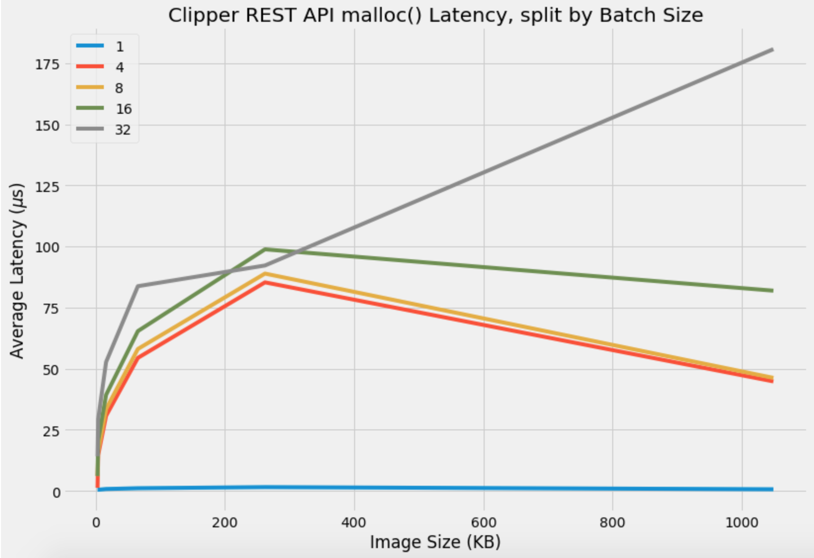
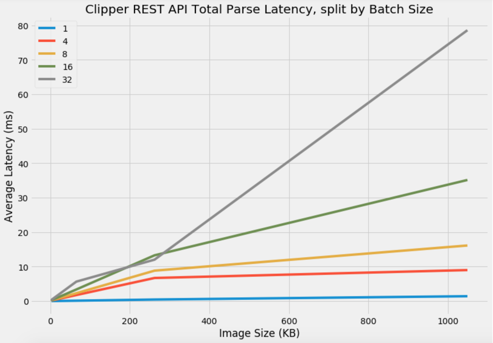
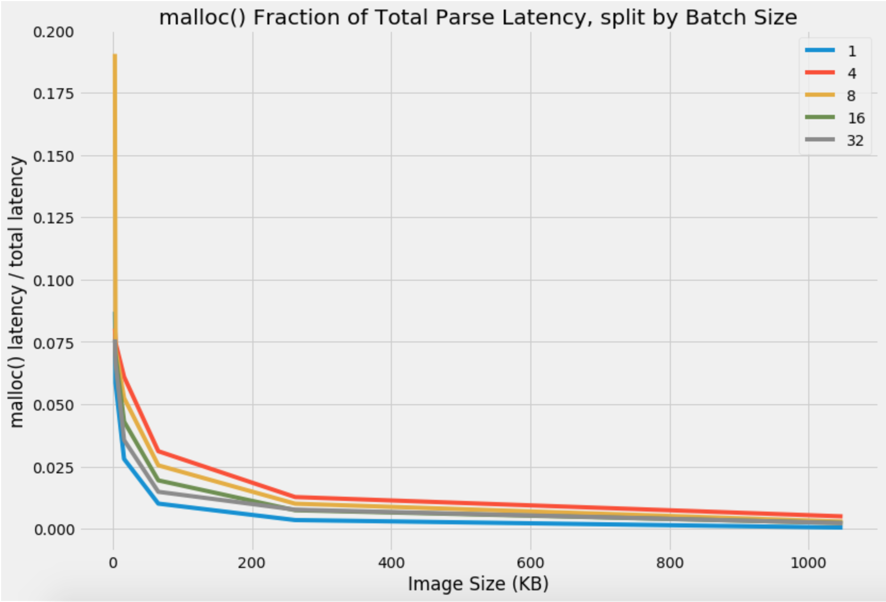

# Clipper Query Frontend REST API: JSON Parsing Latency

The latency in processing JSON has been recorded. This processing involves `malloc()` calls as well as invocations of the C++ library RapidJSON. More specifically, we profiled a Clipper application with input type `float` using six image sizes (28 x 28, 32 x 32 (CIFAR), 64 x 64, 128 x 128, 256 x 256 (ImageNet), and 512 x 512—equivalently, 3136, 4096, 16384, 65536, 262144, and 1048576 respectively in bytes) and five batch sizes (1, 4, 8, 16, 32). For each combination of image and batch size, we ran 500 requests. The profiling was done on a m4.4xlarge Amazon EC2 instance. Here are the raw results for only `malloc()` call latency, in microseconds:

Image Size (KB) | Batch Size | Mean Latency (μs) | Standard Deviation Latency (μs) | Min Latency (μs) | 50th Percentile Latency (μs) | 95th Percentile Latency (μs) | 99th Percentile Latency (μs) | Max Latency (μs)
--- | --- | --- | --- | --- | --- | --- | --- | ---
3.14|1|0.49|0.5|0|1|1.0|1.0|1
3.14|4|1.3|0.8|0|1|2.0|4.99|6
3.14|8|6.1|3.72|0|3|6.0|7.0|21
3.14|16|6.1|3.72|0|3|6.0|7.0|21
3.14|32|14.17|10.35|0|3|10.0|12.0|21
4.10|1|0.5|0.5|0|1|1.0|1.0|1
4.10|4|14.72|11.36|0|3|10.0|12.0|21
4.10|8|16.26|13.05|0|3|9.95|12.0|21
4.10|16|20.59|17.14|0|3|9.0|12.0|21
4.10|32|29.35|25.12|0|4|10.0|12.0|21
16.38|1|0.8|0.81|0|1|1.0|1.0|14
16.38|4|30.76|26.67|0|3|10.0|12.0|21
16.38|8|33.52|29.44|0|3|10.0|12.0|21
16.38|16|39.33|35.01|0|4|10.0|12.0|21
16.38|32|52.77|47.68|0|4|14.0|17.0|18
65.54|1|1.12|0.96|0|1|1|1|14
65.54|4|54.44|49.57|0|4|14.0|17.0|18
65.54|8|58.08|53.2|0|4|14.0|17.0|18
65.54|16|65.39|60.32|0|4|13.95|17.0|18
65.54|32|83.76|78.05|0|4|17.0|20.0|23
262.14|1|1.57|1.28|0|1|1.0|1.0|14
262.14|4|85.33|79.97|0|4|16.95|20.0|23
262.14|8|88.92|83.66|0|4|16.0|20.0|23
262.14|16|98.84|93.22|0|4|16.0|20.0|23
262.14|32|92.23|4.0|81|92|99.0|103.99|108
1048.58|1|0.69|0.62|0|1|1.0|1.0|10
1048.58|4|44.81|44.35|1|4|96.95|99.99|106
1048.58|8|46.25|39.99|1|17|96.0|98.99|106
1048.58|16|81.92|55.14|1|20.5|95.0|98.99|106
1048.58|32|180.72|136.47|1|44|111.0|118.98|126

Here is a line plot to visualize the average results above (in microseconds): 

And here are the raw results for total parsing latency, also in microseconds: 

Image Size (KB) | Batch Size | Mean Latency (μs) | Standard Deviation Latency (μs) | Min Latency (μs) | 50th Percentile Latency (μs) | 95th Percentile Latency (μs) | 99th Percentile Latency (μs) | Max Latency (μs)
--- | --- | --- | --- | --- | --- | --- | --- | ---
3.14|1|5.63|0.51|5|6|6.0|6.99|8
3.14|4|16.18|0.64|16|16|17.0|19.0|21
3.14|8|32.03|11.37|16|17|32.0|34.0|47
3.14|16|80.74|48.05|16|31|62.0|64.0|82
3.14|32|186.51|135.81|16|33|121.0|122.0|136
4.10|1|8.55|2.3|5|6|8.0|8.0|9
4.10|4|197.04|151.06|16|31|121.0|121.0|133
4.10|8|225.26|180.57|16|38|120.0|121.0|133
4.10|16|294.7|243.97|16|39|120.0|121.0|133
4.10|32|441.08|376.91|16|60|152.0|154.99|184
16.38|1|28.57|18.42|5|7|24.0|24.0|38
16.38|4|504.89|439.37|16|61|152.0|154.98|184
16.38|8|639.11|566.96|16|71|152.0|155.0|184
16.38|16|914.13|825.78|16|71|280.0|282.0|306
16.38|32|1483.58|1359.04|16|76|575.0|587.0|601
65.54|1|110.82|86.30|5|23|90|90.99|101
65.54|4|1749.49|1608.45|16|77|575.0|587.0|601
65.54|8|2281.86|2103.68|16|118|574.95|587.0|601
65.54|16|3366.9|3135.72|16|120|1093.0|1112.97|1248
65.54|32|5644.8|5277.26|16|141|2287.0|2308.98|2340
262.14|1|448.39|378.37|5|24|352.0|359.95|362
262.14|4|6704.46|6297.03|16|142|2287.0|2308.98|2340
262.14|8|8829.47|8336.06|16|152|2285.0|2306.98|2340
262.14|16|13284.9|12614.22|16|183|2314.75|4471.95|4542
262.14|32|12020.79|69.3|11838|12014|12155.75|12248.0|12400
1048.58|1|1409.42|7.14|1403|1407|1417.95|1437.92|1472
1048.58|4|8996.97|3935.11|4420|4476|12079.0|12216.89|12266
1048.58|8|16131.12|8057.18|4425|10199|12062.7|12163.99|12266
1048.58|16|35147.52|23579.01|4425|11948.5|22563.95|22631.97|22960
1048.58|32|78610.25|61696.85|4425|12022.5|46646.95|46826.63|47480

And here is a line plot to visualize the average results (in milliseconds): 

So what fraction of the total latency comes from `malloc()`? 

It appears that the overhead from `malloc()` is negligible relative to the rest of the JSON processing!
