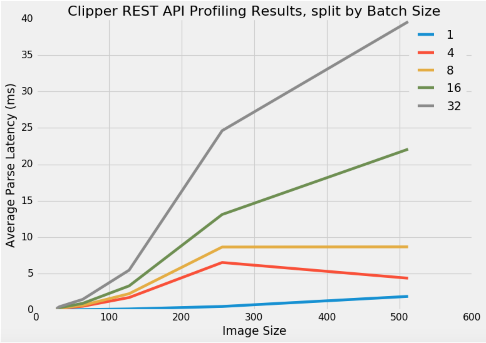

# Clipper Query Frontend REST API: JSON Parsing Latency

The latency in processing JSON, mostly overhead from `malloc()` calls, has been recorded. More specifically, we profiled a Clipper application with input type `float` using six image sizes (28 x 28, 32 x 32 (CIFAR), 64 x 64, 128 x 128, 256 x 256 (ImageNet), 512 x 512) and five batch sizes (1, 4, 8, 16, 32). For each combination of image and batch size, we ran 500 requests. Here are the raw results, in microseconds:

Image Size | Batch Size | Mean | Standard Deviation | Min | 50th Percentile | 95th Percentile | 99th Percentile | Max
--- | --- | --- | --- | --- | --- | --- | --- | ---
28 x 28|1|9.25|4.24|4|5|5.0|6.0|10
28 x 28|4|15.19|5.49|7|14|15.0|17.0|35
28 x 28|8|37.13|21.83|7|14|28.0|34.0|46
28 x 28|16|84.6|61.39|7|18|54.0|56.99|74
28 x 28|32|181.91|143.76|7|28|106.0|109.0|123
32 x 32|1|13.99|8.71|4|5|6.0|7.0|10
32 x 32|4|195.58|165.41|7|18|105.0|108.99|123
32 x 32|8|226.39|195.8|7|18|104.0|108.99|123
32 x 32|16|292.42|257.36|7|27|104.0|108.0|120
32 x 32|32|422.97|379.24|7|28|133.0|139.0|163
64 x 64|1|35.24|27.32|4|5|23.0|23.0|39
64 x 64|4|486.99|440.54|7|35|133.0|139.0|163
64 x 64|8|619.94|566.13|7|36|137.0|140.0|165
64 x 64|16|887.07|817.1|7|53|272.95|274.99|284
64 x 64|32|1436.34|1334.9|7|60.5|556.0|564.0|571
128 x 128|1|119.93|102.15|4|6|89.0|89.0|100
128 x 128|4|1692.47|1577.43|7|68|553.8|564.0|571
128 x 128|8|2218.07|2079.98|7|69|555.95|564.0|571
128 x 128|16|3290.84|3095.13|7|70|1080.0|1099.0|1118
128 x 128|32|5461.35|5178.13|7|102|2003.4|2208.0|2218
256 x 256|1|461.07|404.72|4|6|350.0|360.0|364
256 x 256|4|6507.87|6195.53|7|104|1103.9|2208.0|2218
256 x 256|8|8634.67|8224.75|7|108|2170.0|2208.0|2218
256 x 256|16|13107.75|12470.16|7|134.5|4409.0|4525.99|4580
256 x 256|32|24632.81|23670.84|7|136|4522.95|11658.96|11793
512 x 512|1|1846.3|1665.09|4|22|1395.95|1405.99|1408
512 x 512|4|4347.47|41.35|4138|4342.5|4414.9|4463.93|4593
512 x 512|8|8657.9|1219.86|4314|8946|9083.9|9187.3|9285
512 x 512|16|22087.22|9568.29|4314|9105.5|21445.95|21636.88|22000
512 x 512|32|39613.25|25768.15|4182|4415|47206.95|47354.97|47454

And here is a line plot to visualize the average results, where the *x*-axis is one dimension of the image size in pixels (i.e. 32 corresponds to a 32 x 32 image): 

